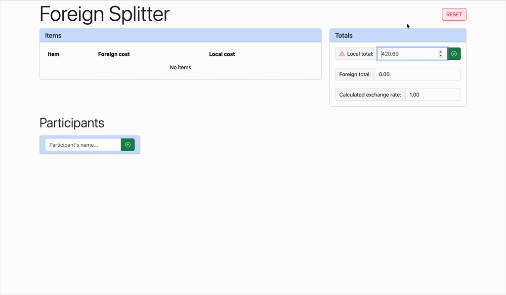

# 🧮 Foreign Splitter


Foreign Splitter is a **Spring Boot / Thymeleaf** app that helps you split expenses in foreign currencies among multiple
participants while automatically converting shares into your local currency.

Imagine you paid at a restaurant for a group of friends while on a trip abroad. Your bill lists item prices in the 
foreign currency, but your credit card charge is in your local currency. You want your friends to pay back exactly what 
you covered. Foreign Splitter helps by calculating the exchange rate used at the time of payment, based on the total 
paid in local currency and the sum of individual items' costs. You can assign items to participants (or multiple 
participants per item to share the cost) and instantly see how much each participant owes in your local currency.  
Check out the demo below to see it in action.

## 🚀 Technologies

This project was built as an exploration of **Spring Boot**, **Spring MVC**, **Thymeleaf**, and backend development best
practices. It also incorporates:

- **Spring Validation** for request validation  
- **JUnit & Mockito** for unit testing  
- **Maven** for dependency management and builds  
- **Docker** for containerization

## 🛠 Running the app

### ☕️ Directly

The app requires **Java 21**. The default port is `8080`, but it can be overridden at runtime.

You can build the app from source using Maven and run the JAR file:

```shell
./mvnw clean package
java -jar target/foreignsplitter-1.0.0.jar # optional: --server.port=9090
```

Or simply run it using Maven directly:

```shell
./mvnw spring-boot:run # optional: -Dspring-boot.run.arguments="--server.port=9090"
```

### 🐳 Dockerized

The app is [published](https://hub.docker.com/r/maslycht/foreign-splitter-java) in Docker Hub and can be run directly:

```shell
docker run -p 8080:8080 maslycht/foreign-splitter-java
```

To build the image locally, run:

```shell
./mvnw compile jib:dockerBuild
```

## 🎥 Demo

